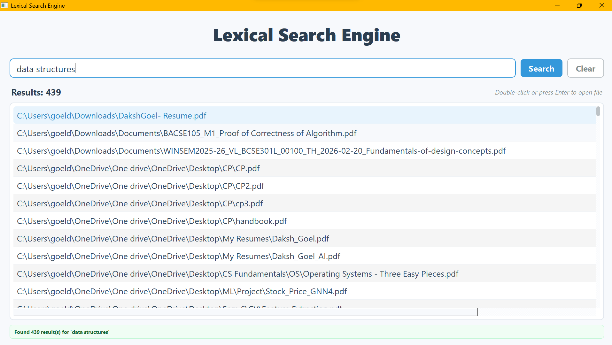

# Smart Lexical Search Engine

## A powerful desktop search application that searches **inside** PDF and Word documents based on content keywords given by the user.

##  Features

### Core Features

-    **Content-based search**: Find documents by keywords inside them
-    **Multi-format support**: PDF and DOCX files
-    **Fast search**: ~0.02 seconds after initial indexing
-    **Smart ranking**: Results sorted by relevance
-    **Auto-complete**: Suggests keywords dynamically as you type

### Enhanced Features (New)

-    **Standalone Executable**: No Python needed! Run straight from your desktop.
-    **Cross-Platform Package**: Install via `pip install smartlex-search`
-    **Modern UI**: Clean, beautifully designed Qt interface with dynamic status indicators.
-    **Parallel processing**: Uses multithreading for blazingly fast background indexing.
-    **Automated Setup**: Completely self-contained, handles NLTK and indexing without scripts!

---

##  Installation

### Method 1: The Standalone App (No Python Required!)

1. Go to the **Releases** page of this GitHub repository.
2. Download `SmartLex.exe`.
3. Double-click it! The app will automatically handle indexing and open right up.

### Method 2: Terminal Package (For Developers)

You can install this directly into your Python environment as a global package.

1. **Install via pip**
```bash
pip install smartlex-search
```

2. **Run it from anywhere**
```bash
smartlex
```

*(Note: To install the developer version from source, simply clone the repo and run `pip install -e .`)*

---

##  Usage

### First Run (Indexing)

Whether you use the `.exe` or the `smartlex` terminal command, the application will automatically detect if it is your first time running it. It will launch a background scanner that sweeps your drives for PDFs and Word documents, extracts their keywords using advanced NLP, and builds your local index.

⏱️ **First run**: Depends on the number of files (usually a few minutes)
⏱️ **Subsequent runs**: Instant! The UI will pop open in less than a second.

### Regular Usage

1. Type keywords in the modern search bar (e.g., "machine learning").
2. The dynamic auto-complete will suggest words based specifically on the contents of your own files!
3. Press Enter or click Search.
4. Click or double-click any beautifully formatted result to instantly open the document.

### Keyboard Shortcuts

-   `Enter`: Search / Open selected document
-   `Tab`: Switch between search bar and results
-   `↑/↓`: Navigate through results
-   `Ctrl+F`: Focus the search bar
-   `Esc`: Clear search / Close application

---

##  How It Works

### Architecture

```
User Query → RAKE Extraction → Keyword Matching → Ranking → Results
                                       ↑
                Document Index ← Multithreading ← Automated File Scanner
```

### Step-by-Step Process

#### 1️ **File Collection** (First Run Only)
-   The internal Python scanner recursively sweeps all connected system drives.
-   It strictly filters out system folders (`Windows`, `Program Files`, `.git`) for maximum speed.
-   It collects all PDF and DOCX file paths.

#### 2️ **Parallel Indexing** (First Run Only)
-   Multiple background threads parse the documents simultaneously to maximize CPU efficiency.

#### 3️ **Keyword Extraction** (RAKE Algorithm)
```text
Input: "Machine learning algorithms use neural networks"
        ↓
Remove stopwords: "Machine learning algorithms use neural networks"
        ↓
Extract phrases: ["machine learning algorithms", "neural networks"]
        ↓
Split to words: ["machine", "learning", "algorithms", "neural", "networks"]
```

#### 4️ **Index Storage**
The system builds an ultra-fast lookup dictionary (`output.json`):
```json
{
    "C:/docs/paper1.pdf": ["machine", "learning", "neural", "network"],
    "C:/docs/paper2.pdf": ["algorithm", "optimization", "training"]
}
```

#### 5️ **Search Process**
```text
User types: "neural network training"
        ↓
Extract keywords: ["neural", "network", "training"]
        ↓
Find matching documents:
  paper1.pdf: 2 matches (neural, network)
  paper2.pdf: 1 match (training)
        ↓
Rank by relevance:
  1. paper1.pdf (score: 2)
  2. paper2.pdf (score: 1)
```

---

##  Project Structure

```text
SmartLex/
│
├── pyproject.toml         # Package configuration
├── run.py                 # PyInstaller entry point
│
├── src/smartlex/
│   ├── main.py            # Core application entry
│   ├── core/              # NLP, parsing, and indexing logic
│   └── gui/               # PyQt5 interface and background threads
│
├── requirements.txt
├── config.json
└── README.md
```

---

## Reference

-   [Base Paper / Reference PDF](https://drive.google.com/file/d/10f3bUmaTRzAZ2jOq6oWFu0ilP6Q6dyJx/view?usp=sharing)

---

## Sample Screenshots
- ### 🪟 Initial Window


### 📄 Output Window



### Future enhancement
- Working on adding support for additional file types such as TXT, CSV, XLSX, PPTX, HTML, etc.
- Currently working on similar functionality for images, audios etc.
